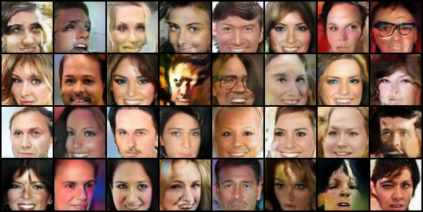

# BNGAN
Bayesian Network GAN

(several development branches - master represents the recent experiment, but it's messy. To be cleaned if this progresses)

## Main Idea

Generative adverarial networks have come a long way and reignited interest in unsupervised learning. No longer just used for Image Synthesis, GANs now are used for text generation, forward prediciton, autoencoding, data augmentation, classification, and many other tasks. 

As with all generative models, effective sampling is an open question. GANs may (but probably don't) learn a proper density given large amounts of data. But sampling from the learned data density in a principled manner is difficult. In this project we explore methods for conditional image generation - given some explicit query. The difficulty with doing this in a vanilla GAN lies in the fact that GANs are train totally unsupervised, and start from pixels. There is no need to develop intermediate (read: structured) representations. Because humans typically think in a more structured manner, the way GANs encode data is not intuitive to us. Unsupervised discovery of factors of variation is possible, but its inefficient and is highly suceptible to data noise. Current disentanglement techniques waste dimensions by either discovering non-important factors, or none at all. 

Bayes Nets are a time-tested way to encode structure and relationships between different nodes (factors of variation). In the cases where humans can easily create the graph, i.e. what facial attributes should vary together, we propose using a trained Bayes Net as the input to a GAN. 

## Results

WGAN with ResNet Generator and Discriminator

It just started training relax. 
